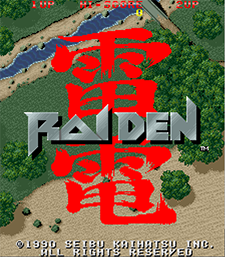
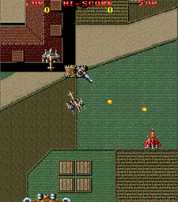
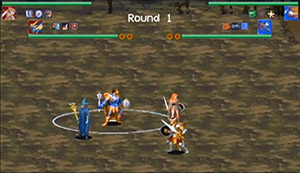

### Carles Margelí

## Introduction

Im Carles Margeli, current student of the Bachelor's Degree of Design and Development of Videogames of the UPC in Barcelona. During the course I have made some projects for the university subjects and in addition some personal work. It can be seen the process of learning and difficulty of the games made, increasing by the time. This is my library of work ordered chronollogically.

//Vertically chrnollogically ordered.//

//Link repo + screenshots or videos//

## Works library

 - [Raiden 1990](https://github.com/Margeli/Raiden1990) <Jun 2017>: A 2D vertical scrolling spaceship shooter game, based on the popular game Raiden (1990). It contains a fully playable level with 3 types of enemies and different upgrades to your ship. Made by scratch in C++ language with SDL2 library as a project work for the subject Project I of the Bachelor's Degree of Design and Development of Videogames, 1st year. [YouTube Link](https://www.youtube.com/watch?v=EJwJTQpdpZE&feature=youtu.be)
 
     

 

 
 
 
 - [Cave Night](https://github.com/Margeli/Assignment3) <Dec 2017>: A 2D horizontal scrolling plataformer game. 2 playable levels with enemies that follow an A* pathfinding and with collectables. Made by scratch in C++ with SDL2 library as a project work, in pairs, for the subject Game Development of the 2nd year.
 
      

 
 - [Race Game](https://github.com/Margeli/RaceGame) <Jan 2018>: A 3D racing game. A racing circuit full of obstacles where the player drives a car during 3 laps to try to achieve the best time of the circuit. Made in C++ with SDL, OpenGL and Bullet library as a project work for the Physics subject of the 2nd year, done in pairs.
 
      

 
 - [Shadow over Mystara](https://github.com/NOREADMEStudios/ProjectII) <Jun 2018>: A 2D fighting game based on the popular game "Dungeons and Dragons: Shadow over Mystara" for up to 4 players. Developed by the team NO README STUDIO, made by scracth in C++ with different libraries as a project for the Project II subject of the 2nd year of the degree.  [YouTube Trailer](https://www.youtube.com/watch?v=KRnLJtiJEfU)
 
   In Shadow over Mystara I have taken care of: 
    - Code Organization
    - Engine core development
    - Scenes designing
    - Intro Settings
    - Input buttons
    - Reading sprites animations data from .xml & .tmx
    
      

 - [3D Engine](https://github.com/Normanbg/3dEngine) <Dec 2018>: A 3D Game Engine based on Unity, capable of loading models and textures in different formats. Focused in the UI system. Developed in 3 months, in pairs, made by scratch in C++ and different libraries like OpenGl, DevIl, MathGeoLib, TrueType... for the 3D Engines subject of the 3rd year of the degree. 
 
 - [GrasShop](https://grasshop420.wixsite.com/website) <Dec 2018>: A 3D Game god game where the player manages a cannabic club to survive 7 days without losings. Focused in the AI of the behavioors of the characters of the game. Made in Unity for the the Artificial Intelligence subject of the 3rd year.

 - [Malita](https://typhoonstudio.itch.io/malita) <Jun 2019>: A 3D Game fast-paced beat 'em up game inspired by the universe of Battle Angel Alita. Made by scratch in our own engine [Project Atlas](https://github.com/project-3-bcn-2019/Project-Atlas) made by the whole class in the subject Project III of the 3rd year of the degree.  

   In Malita I have taken care of:
    - Engine core development
    - Engine UI system
    - Engine pathfinding editor
    - Pathfinding graph of the enemies
    
 
- Game Jams: During the degree I voluntarelly participated in 3 Game Jams. 
     - [Don't Smile](https://github.com/Margeli/dont-smile-by-petabytes): Barcelona Games World <Oct 2017>  A 2D vertical scrolling made in our first versions of our own Engine. 
     - [Wolf Game](https://github.com/Margeli/PetaBytes): Gran CITM Jam <Jan 2019>  A 2D game made by Unity where you are a wolf that need to scare all the animals in the farm. 
     - [Deep](https://github.com/Margeli/GranCITMJam_2): Gran CITM Jam 2 <Jun 2019> A 3D game made by Unity of a submarine that need to clean nuclear waste in a cave with different obstacles. Winner of the "BEST TECHNOLOGY" prize in the game jam.

